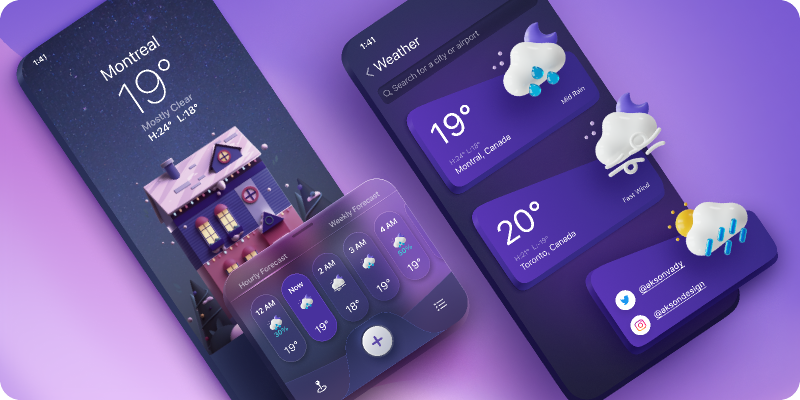

# Weather Forecast App



## Table of Contents
- [About](#about)
- [Features](#features)
- [Getting Started](#getting-started)
  - [Prerequisites](#prerequisites)
  - [Installation](#installation)
- [Usage](#usage)
- [Contributing](#contributing)
- [License](#license)

## About
The Weather Forecast App is a C# application that fetches weather data from an API and displays it to users. It provides accurate weather information for specified locations, helping users plan their activities accordingly.

## Features
- Get real-time weather data for a specific location.
- View details like temperature, wind speed, humidity, and more.
- User-friendly interface for easy navigation.

## Getting Started
Follow these steps to set up and run the Weather Forecast App on your local machine.

### Prerequisites
- Visual Studio (or any C# development environment)
- .NET Core SDK
- Internet connection to fetch weather data from the API

### Installation
1. Clone the repository to your local machine:
   ```bash
   git clone https://github.com/NobleOsinachi/ForecastBuddy.git
   ```

2. Open the project in Visual Studio.

3. Build and run the application.

## Usage
1. Launch the Weather Forecast App.

2. Enter the location (e.g., city name or coordinates) for which you want to fetch weather data.

3. Click the "Get Weather" button to retrieve and display the weather forecast.

4. Explore the weather details, including temperature, wind speed, humidity, and more.

## Contributing
We welcome contributions from the community. If you'd like to contribute to the Weather Forecast App, please follow these guidelines:
1. Fork the repository.
2. Create a branch for your feature or bug fix.
3. Make your changes and commit them with descriptive messages.
4. Push your changes to your fork.
5. Create a pull request to the main repository.

## License
This project is licensed under the MIT License - see the [LICENSE](LICENSE.md) file for details.
